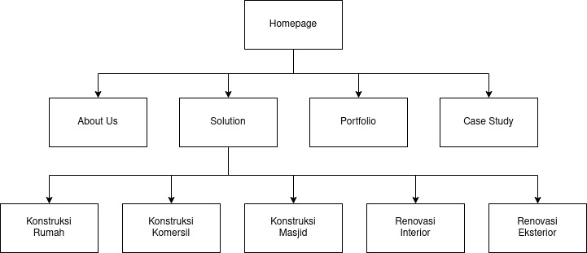

# Website Project Documentation - Taawun Build

**Bismillahirrahmannirrahiim.**

## Website Overview

Website yang menampilkan value dan branding dari Ta'awun Build dan menjadi salah satu media marketing secara digital.

### Functionality
- Brand profile
- Marketing channel
- Lead generation
- Portfolio

### Sitemap

### Feature

- Design and development webpages :
  - Homepage
  - About us page
  - Solution :
    - Konstruksi Rumah
    - Konstruksi Komersil
    - Konstruksi Masjid
    - Renovasi Interior
    - Renovasi Eksterior
  - Portfolio
  - Case Study
- Tambah, edit, hapus testimonial
- Tambah, edit, hapus link akun sosial media
- Call-to-action (WhatsApp atau form)
- Tambah, edit, hapus project di Portfolio

### Technology

Menggunakan bahasa pemrograman JavaScript. Memungkinkan penggunaan bahasa pemrograman lain jika diperlukan.

Framework atau teknologi :
- [Nuxt JS](https://nuxtjs.org)
- [Directus](https://directus.io)
- [Tailwind](https://tailwindcss.com)

!> Penggunaan bahasa pemrograman, framework, atau teknologi dapat berubah ketika berjalannya project jika diperlukan. Dengan fokus utama adalah dapat membantu website yang dihasilkan baik.

Web server :
- Nginx atau Caddy